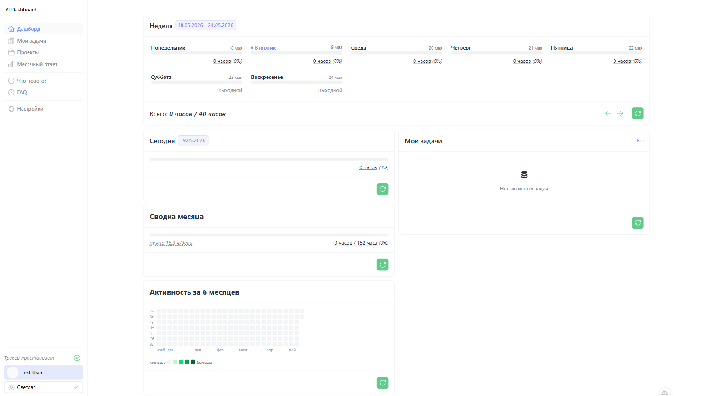
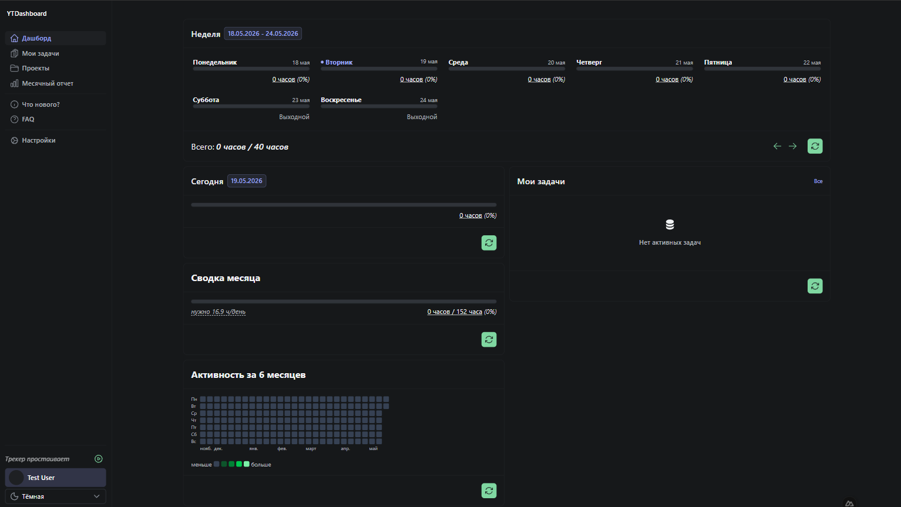

# Yandex Tracker Dashboard

[](https://github.com/lenston19/yandex-tracker-dashboard/releases)
[](https://hub.docker.com/r/lenston19/yandex-tracker-dashboard)
[](https://nodejs.org/)
[](LICENSE)

A client dashboard for the Yandex Tracker API. Track time spent, manage tasks, and generate reports through a convenient interface.

|                   Light theme                   |                Dark theme                |
| :---------------------------------------------: | :--------------------------------------: |
|  |  |

## Features

- **Dashboard** — widgets for the current day, week, and month. Shows accumulated salary when a rate is configured.
- **Weekly widget** — click on a day to see a breakdown of time logged per task.
- **Heatmap** — activity visualization by day for a selected period.
- **Timer** — start tracking directly from the interface with auto-logging on stop.
- **My issues** — list of active tasks with search by name and filtering by queue.
- **Projects** — queue cards for queues where the user has worked and logged time.
- **Monthly report** — time log chart for the month with an average value.
- **Settings** — rate, planned hours per day, timezone, display options.

## Getting Started

### Requirements

- Node.js >= 24
- PNPM >= 10

### Local

1. Clone the repository:
    ```sh
    git clone https://github.com/lenston19/yandex-tracker-dashboard.git
    cd yandex-tracker-dashboard
    ```

2. Install dependencies:
    ```sh
    pnpm install
    ```

3. Create `.env` from `.env.example`:
    ```sh
    cp .env.example .env
    ```

4. Start the dev server:
    ```sh
    pnpm dev
    ```

### Docker

```sh
docker pull lenston19/yandex-tracker-dashboard:latest
docker run -p 3000:3000 \
  -e NUXT_PUBLIC_YANDEX_CLIENT_ID=YOUR_CODE \
  lenston19/yandex-tracker-dashboard:latest
```

Available tags: `latest` (stable), `unstable` (dev build).

## Configuration

### Authorization

Get your organization ID from the [Yandex Cloud Center](https://center.yandex.cloud/) and sign in via Yandex OAuth.

Set `NUXT_PUBLIC_YANDEX_CLIENT_ID` — you can create one in [Yandex OAuth](https://oauth.yandex.ru/client/new/).

> For local authorization, obtain an ACCESS_TOKEN and open `http://localhost:3000/auth#access_token=<TOKEN>`

### Environment Variables

| Variable                           | Description                             |
| ---------------------------------- | --------------------------------------- |
| `NUXT_PUBLIC_YANDEX_TRACKER_API`   | Yandex Tracker API URL                  |
| `NUXT_PUBLIC_YANDEX_CLIENT_ID`     | OAuth Client ID                         |
| `NUXT_PUBLIC_ORGANIZATION_ID_LINK` | Link to get the organization ID         |
| `NUXT_PUBLIC_THEME_TYPE`           | Seasonal theme: `halloween`, `new-year` |

## Stack

- [Nuxt 4](https://nuxt.com/)
- [Nuxt UI 4](https://ui.nuxt.com/)
- [Pinia](https://pinia.vuejs.org/)
- [VueUse](https://vueuse.org/)
- [Apexcharts](https://apexcharts.com/)
- [date-fns](https://date-fns.org/)
- [Vue Final Modal](https://vue-final-modal.org/)

---

> If the app starts but the Nuxt loader spins indefinitely — check domain proxying (relevant for users in Russia):
> `*.fontshare.com`, `*.fontsource.org`, `*.bunny.net`
